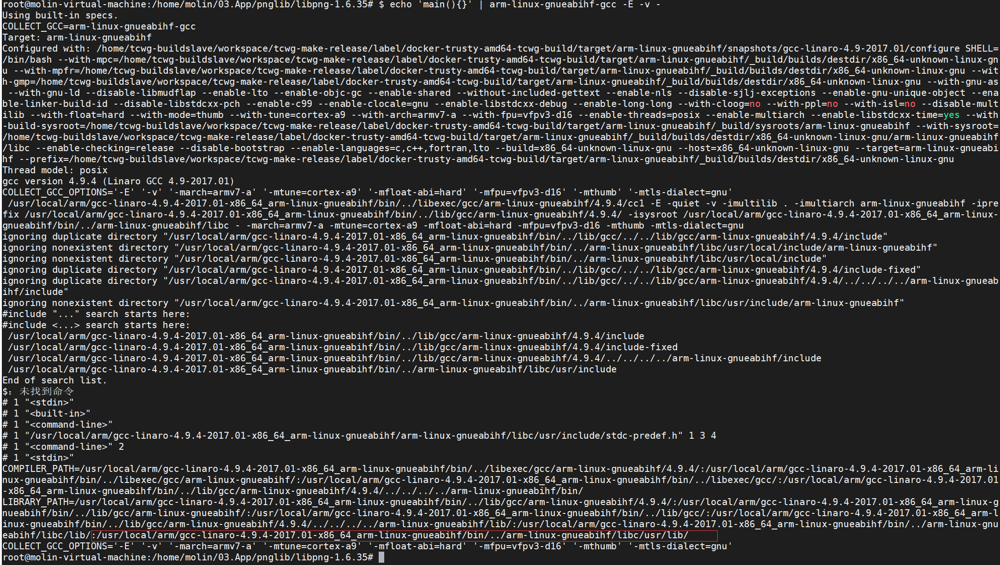

# 项目记录

## 软件安装

1.   输入命令`$ echo 'main(){}' | arm-linux-gnueabihf-gcc -E -v -` 来查看交叉编译链的信息

2.   将编译出来的库和头文件移植到上图红框目录下，执行以下命令

     ```
     cp include/* -rf /usr/local/arm/gcc-linaro-4.9.4-2017.01-x86_64_arm-linux-gnueabihf/arm-linux-gnueabihf/libc/usr/include
     
     cp lib/* -rf /usr/local/arm/gcc-linaro-4.9.4-2017.01-x86_64_arm-linux-gnueabihf/arm-linux-gnueabihf/libc/usr/lib
     ```

3.   导出环境变量

     1.   PATH：大家应该都很熟悉。安装一个包后可能会在安装目录建立一个bin目录，里面都是些可执行程序，为了让系统能找到这些程序，就需要我们把该路径加入到PATH环境变量中

     2.    LDFLAGS：gcc等编译器会用到的一些优化参数，也可以在里面指定库文件的位置。用法：LDFLAGS=“-L/usr/lib -L/path/to/your/lib”。每安装一个包都几乎一定的会在安装目录里建立一个lib目录。如果你明明安装了某个包，而安装另一个包时，它愣是说找不到，那就把那个包的lib路径加入的LDFALGS中试一下

     3.   CFLAGS：和LDFLAGS类似，只不过要向里加如的是头文件（.h文件）的路径，如：CFLAGS=“-I/usr/include -I/path/to/your/include”。同样地，安装一个包时会在安装路径下建立一个include目录，当安装过程中出现问题时，试着把以前安装的包的include目录加入到该变量中来

### zlib的安装

```
$ tar -zxvf zlib-1.2.11.tar.gz
$ cd zlib-1.2.11
$ ./configure --prefix=安装路径
$ make
$ make install
```

### libpng的安装

以下是安装libpng的具体步骤：

>    要解决这个问题最重要的是要了解到libpng库是不需要configure的，因为在scripts目录下已经提供makefile，所以没有必要使用configure来创建makefle文件了。因此把scripts目录下makefile.linux拷贝到源码包根目录中，直接make就可以。但是为了解决找不到zlib库这个问题，所以需要修改这个makefile


​     **（1）cp scripts/makefile.linux makefile**

​     **（2）vim makefile**

​     **（3）makefile中找到zlib相关的两行，修改成实际的zlib/lib和zlib/include，再找到prefix项，修改为你想prefix的目录中，**

​       **如果此处是交叉编译的话，还需要在cc那边把gcc修改成您系统的交叉编译器，比如：arm-linux-gcc**

​     **（4）保存并且make make install**

### freetype的安装

```
tar -zxvf freetype-2.10.2.tar.gz
cd freetype-2.10.2
./configure --host=交叉编译链 --prefix=安装路径
 make
 make install
```

## 项目推送到Github

1. 先创建git仓库：`git init`

2. 配置好用户名和邮箱

    ```
    git config --global user.name "xxx"
    git config --global user.email "xxx@xx"
    ```

3. 查看配置文件：` git config --list`

4. 帮助命令：` man git config`

5. 添加修改文件命令`git add xxx`,提交命令：`git commit -m "修改的了啥"`

6. 添加和提交同时进行命令:` git commit -am "修改的了啥"`

7. 添加一个远程仓库 `git remote add origin git@github.com:Embedded-porter/Frame-learning.git  ` 

8. 将本地的master与远端的origin关联起来：`git push -u origin master`

9. 查看当前项目与远端的连接数 `git remote show`

10. 使用ssh的時候生成公钥的命令：` ssh-keygen -t ecdsa -b 521 -C "2771182515@qq.com"`,密钥一般存放在/home/.ssh文件中,其中`id_rsa（私钥）` `id_rsa.pub（公钥）`

11. 将公钥放到github上:`setting->Deploy keys->Add deploy key`

12. 推送命令：`git push`

13. 拉取命令：`git pull`

14. 创建分支：`git checkout master`

15. 与远端建立连接：`git branch --set-upstream-to=origin/master`


